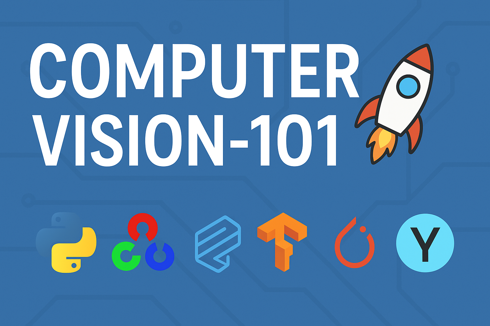

# COMPUTER-VISION-101 📸🤖

  
  
  

---

## 👋 Introduction

Welcome to my **Computer Vision Learning Journey**! 🚀  

Over the next **3 months**, I’ll dive deep into **Computer Vision**, starting from the basics and gradually moving to advanced concepts. My goal is to **build real-world projects** while mastering key tools like:  

- **OpenCV** – image and video processing  
- **Mediapipe** – real-time hand, pose, and face detection  
- **TensorFlow / PyTorch** – deep learning and CNNs  
- **YOLO** – fast object detection  

This repo will be updated **weekly** with:  

- 📖 **Learning notes**  
- 🛠️ **Mini-projects & experiments**  
- 🚀 **Milestone projects**  

By the end, I aim to have **4 solid projects** demonstrating real-world CV applications.

---

  

---

## 🗓️ Roadmap (Living Document)

| Week | Focus | Status | Notes |
|------|-------|--------|-------|
| 1 | **OpenCV Basics** – image I/O, color spaces, resizing, transformations | 🟡 In Progress | [Notes →](#) |
| 2 | Image Processing – edges, contours, thresholding | ⚪ Pending | - |
| 3 | **Mediapipe Essentials** – hand/pose/face detection | ⚪ Pending | - |
| 4 | Deep Learning Basics (CNNs with TensorFlow) | ⚪ Pending | - |
| 5 | Advanced CV with PyTorch | ⚪ Upcoming | - |
| 6 | Object Detection (YOLO) | ⚪ Upcoming | - |
| 7 | Image Segmentation | ⚪ Upcoming | - |
| 8 | Real-world Mini-project 1 | ⚪ Upcoming | - |
| 9 | Real-world Mini-project 2 | ⚪ Upcoming | - |
| 10 | Milestone Project 1 | ⚪ Upcoming | - |
| 11 | Milestone Project 2 | ⚪ Upcoming | - |
| 12 | Milestone Project 3 | ⚪ Upcoming | - |

---

## 🚀 Planned Projects

| Project | Description | Status | Demo |
|---------|-------------|--------|------|
| Hand Gesture Recognition | Real-time hand gesture detection and classification | 🟡 Planned |  |
| Object Tracking System | Track moving objects in video | ⚪ Planned |  |
| YOLOv8 Object Detection | Detect multiple objects efficiently | ⚪ Planned |  |
| Real-time Pose Estimation | Skeleton-based pose tracking | ⚪ Planned |  |

---

## 📚 Learning Artifacts

Each week, I will produce:  

- 📄 **Notes** – Markdown / PDFs of key concepts  
- 🧩 **Mini-projects** – scripts + visual results  
- 📊 **Visualizations** – heatmaps, graphs, metrics  

---

## ⚡ Tech Stack

  
  
  
  
  
  

---

## 🛠️ Learning Resources

- [OpenCV Docs](https://docs.opencv.org/)  
- [Mediapipe Docs](https://google.github.io/mediapipe/)  
- [TensorFlow Tutorials](https://www.tensorflow.org/tutorials)  
- [PyTorch Tutorials](https://pytorch.org/tutorials/)  
- [YOLOv8 Docs](https://docs.ultralytics.com/)  
- [Awesome Computer Vision GitHub](https://github.com/jbhuang0604/awesome-computer-vision)  

---

## 🤝 Collaboration

I’m open to:  

- Feedback on my projects  
- Suggestions for new mini-projects  
- Sharing learning resources  

⭐ Feel free to fork, submit PRs, or reach out!

---

## 💡 Motivation

> “I want to build projects that combine computer vision and AI to solve real-world problems like automation, robotics, and smart applications.”

---

## 📈 Weekly Progress (Example)

| Week | Notes | Mini-Project | Status |
|------|-------|-------------|--------|
| 1 | ✅ OpenCV basics, image I/O, color spaces | ✅ Image resize & rotate scripts | 🟢 Done |
| 2 | ⚪ Edges & contours learning | ⚪ Pending | ⚪ Pending |
